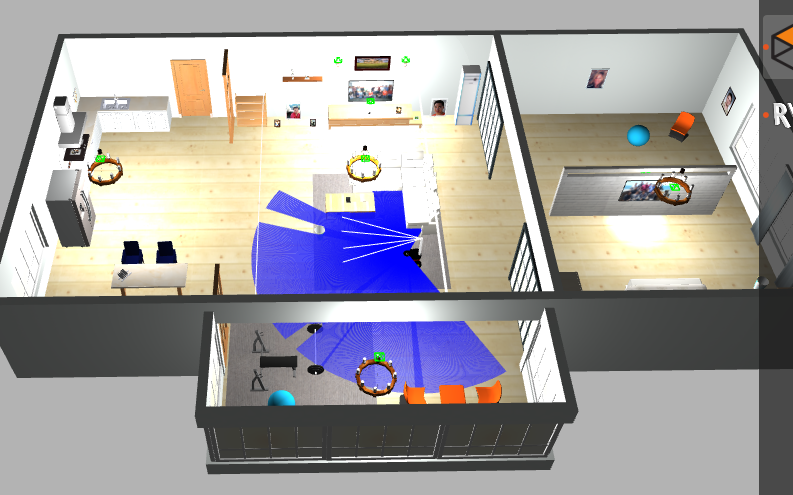

# Pioneer Playground

### Requirements
ROS-Noetic

## Dependencies
Get Pionner Mesh file 
```
cd catkin_ws/src
git clone https://github.com/MobileRobots/amr-ros-config.git
```

Get world file
```
cd catkin_ws/src
git clone https://github.com/aws-robotics/aws-robomaker-small-house-world.git
```

Realsense plugin
```
cd catkin_ws/src
git clone https://github.com/pal-robotics/realsense_gazebo_plugin.git
```

Then build

```
cd ..
catkin_make
source devel/setup.bash
```

## Launch

```
roslaunch pioneer_playground pioneer3at-home.launch 
```

Then it would look like 




Ros Topics

```
/camera_controller/color/camera_info
/camera_controller/color/image_raw
/camera_controller/depth/image_raw
....
/clock
/cmd_vel
/gazebo/link_states
/gazebo/model_states
/gazebo/parameter_descriptions
/gazebo/parameter_updates
/gazebo/performance_metrics
/gazebo/set_link_state
/gazebo/set_model_state
/joint_states
/odom
/rosout
/rosout_agg
/scan
/tf
/tf_static
```

## Pantilt
```
roslaunch pioneer_playground gazebo.launch 
```